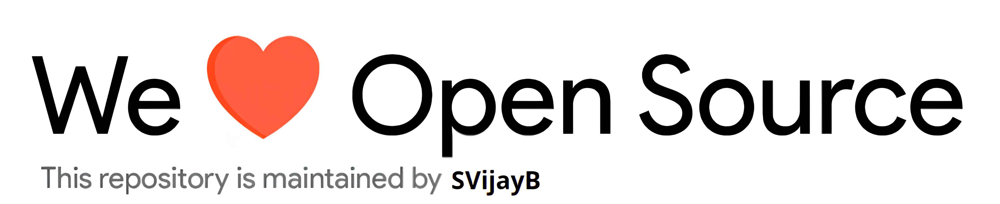

Cookerooni!

    
     Short description of the project

---

    

## Table of Contents

-   [Motivation](#Motivation)
-   [Installation](#Installation)
-   [Usage](#Usage)
    -   [Project Demo](#Demo)
-   [Contributing](#Contributing)
-   [License](#License)

## Motivation

<!--- Insert product screenshot below --->

<!--- replace with motivation for your project --->

In order to easily to create a new project, I have created a standard template for the all my projects.
This template currently contains the following features:

-   Issue templates.
-   Pull request templates.
-   Contributing guidelines.
-   Code of conduct.
-   Required resources to help people start contributing.
-   README.md file with a basic setup.

Simply search and replace `Repo-Template` with the name of your project.

Or, you can use the `assets\template-script.py` to automate the process.
Run the file by using the following command, `py template-script.py`.

## Installation

<!--- Provide instructions on installing the application --->

For the latest stable version, head to [Releases](https://github.com/riyosha/cookerooni/releases).

Download and extract the source code.

As an alternative, you could also clone the repository using,

<pre>
git clone https://github.com/riyosha/cookerooni
</pre>

Once you have the source code, create a virtual environment using the following command,
`python3 -m venv venv`

Enter the virtual environment and install dependancies using `pip install -r requirements.txt`.

## Usage

<!--- Provide instructions on how to use the application after installing it --->

To launch the file, use the following command, `python3 app.py`.

<!--- You can also add in screenshots, app demo (Gif format) or even provide link to other resources --->

### Project demo

You can also find the demo video [here](https://www.youtube.com/watch?v=dQw4w9WgXcQ).

## Contributing

To contribute to Repo-Template, fork the repository, create a new branch and send us a pull request. Make sure you read [CONTRIBUTING.md](https://github.com/riyosha/cookerooni/blob/master/.github/CONTRIBUTING.md) before sending us Pull requests.

Thanks for contributing to Open-source! ❤️

## License

Repo-Template is under The MIT License. Read the [LICENSE](https://github.com/riyosha/cookerooni/blob/master/LICENSE) file for more information.

---

